# Screen Decorations

Full-screen shader effects (poison, bleed, fog, drunk, concussion, tunnel vision, death) drawn over
the finished frame, plus a CPU-side screen shake driven from the same place.

Orientation doc. Verify line numbers before acting on them; they drift.

## Model

Four tiers. Nothing crosses these boundaries.

| Tier | Owns | Where |
|---|---|---|
| **Layer effect** | One layer's look, and that technique's own knobs | `Configuration/FeatureConfigs/ScreenDecorations/Effects/` |
| **Profile** | Which effects, in what order, blended how; fade, shake, scope | `.../ScreenDecorations/Profiles/` |
| **Trigger** | Whether it is firing, and what it knows at that instant | `Game/ScreenDecorations/Triggers/` |
| **Rule** | Wiring and metadata. **Carries no parameters of its own** | `.../ScreenDecorations/Rules/` |

Runtime strength is a fixed stack of multipliers in [0,1]; every stage can only attenuate:

```
final = profile (authored) × trigger.Intensity × fade envelope × global setting
```

A trigger's own floor (e.g. `SoundPlayedParameters.MinIntensity`, 0.25) is what stops the chain
collapsing. Pulse sits outside this chain and is the one thing that can swell above the authored
value: the shader applies `1 + PulseAmp * sin(…)`, bounded only by the final `saturate`.

### Layer effects

Polymorphic **authoring** model — the subtype *is* the technique, so a technique's knobs exist only
on the type that reads them.

```
abstract LayerEffect        // Shape, Noise, Strength, Pulse — every technique masks and swells
├── TintEffect        { Tint }
├── BlurEffect        { Radius, Taps }
├── RadialBlurEffect  { Zoom, Taps }
└── ChromaticEffect   { Aberration }        // fixed 3 taps, one per channel
```

Fixed set of four: the shader has four techniques and config cannot describe a fifth.

`Bake()` flattens to `OverlayParams` (the GPU wire format) and clamps on the way — the safety
ceilings are not the caller's to skip. `LayerEffectFactory.FromParams` is the inverse, which is how
tuned presets become built-in profiles without being retyped.

### Spec mirrors — read this before touching parameters

`ShapeSpec`, `JitterSpec`, `NoiseSpec` (in `Effects/`) are **authoring mirrors** of the renderer
structs `OverlayShape`, `OverlayJitter`, `OverlayNoise`. Same field names, same JSON.

- The **spec** is what the property grid edits and what config persists. It carries the
  `[LocalizedDisplayName]` / `[LocalizedDescription]` metadata.
- The **renderer struct** is pure GPU wire format and carries no editor metadata, so
  `ClassicUO.Renderer` does not depend on any UI toolkit.
- `spec.ToParams()` / `Spec.From(in …)` convert. **Add a field to one, add it to both.**

`FadeSpec`, `ShakeSpec`, `PulseSpec` are *not* mirrors — no renderer twin.

### Profiles

`EffectProfile` — `Guid Id` (rules reference this, so renaming is free), `Name`, `FullScreen`,
`List<ProfileLayer> Layers` (back-to-front), `FadeSpec Fade`, `ShakeSpec? Shake`.

`ProfileLayer` wraps `{ LayerEffect Effect, OverlayBlend Blend }`. Blend lives on the wrapper, not
the effect: blending is a property of the stack, not the look — the same blur belongs in two
profiles blended differently.

Shake is **not** a layer: it isn't drawn, and two composed shakes within one look cannot mean
anything. `ShakeSpec` carries the whole envelope — `Trauma`, `DurationSeconds`, `RampUp/DownSeconds`,
`Gradient`, `Curve`, `Frequency`. An impact is `Decay` with no ramps; a quake is `Constant` with both
ramps, so it builds, holds, subsides.

`EffectProfile.FullScreen` governs **both** halves of scope — which pass draws the layers, and which
rectangle the shake displaces. One switch, because an effect that shakes the world while tinting the
UI reads as two unrelated things. Hence two independent shake accumulators,
`ScreenShake.Viewport` and `ScreenShake.Window`, each sampled once per frame at its own blit.

One flat pool, shared by reference. Shipped profiles (`BuiltInProfiles`) resolve from code every
session and are never stored, so a retuned look reaches everyone using it. Copying one produces an
ordinary user profile.

### Triggers

`TriggerSignal { float Intensity, TimeSpan? Duration }` is the **entire** crosstalk surface. A poll
returns one; an event carries the identical struct; the manager never branches on kind.

`ITriggerDefinition` is code, fixed at startup: stable string `Id` (rules persist this, not the
`DisplayName`), `Kind` (Poll/Event), `IsStateful`, `ParameterType`, `Create(TriggerParameters?)`,
`CreateDefaultParameters()`. Shipped definitions live in `Triggers/Definitions/` and are listed by
`TriggerCatalog`.

Duration comes from the trigger either way: inherent (a quake sound's length), parameterized, or
absent — a stateful trigger raises `Ended` instead.

`TriggerParameters` subtypes are narrow and polymorphic for the same reason layer effects are; a
string bag would push every type error to runtime and cannot be described by a generated serializer
context. Attribute/property triggers build their conditions on `Game/Logic/` (`LogicNode`,
`LogicEvaluator`, `LogicSchema`).

### Rules

`OverlayRule` — `Guid Id` (**the compositor slot key**), `Name`, `Guid ProfileId`, `TriggerBinding`,
`Order`, `Enabled`. `Priority => -(int)Order`: the rulebase is lowest-first, the compositor takes
higher as stronger, and inverting at read time removes a second field to keep in step.

**Evaluation is firewall-style: top to bottom, first match claims the effect.** A rule below one that
already claimed the same *profile* is skipped, and not even sampled. Two rules raising *different*
looks both draw — that is what composition is for. The rule exists because a look decides things that
are singular, notably whether its shake displaces the window or only the viewport.
`ScreenOverlayManager.SelectFirstMatches` is the whole policy, extracted and unit tested.

Shipped rules (`BuiltInRules`) resolve from code; only what the user changed (`Enabled`, `Order`) is
stored, as `OverlayRuleOverride`. Like every switch here they ship **off** — these effects obscure
and displace the world, so a clean profile draws nothing until asked.

## Runtime

### Manager (`Manager/ScreenOverlayManager.cs`)

Reconciles rather than reacts: each pass works out the set of overlays the rules in force call for
and moves the compositor toward it, so a missed transition cannot strand an overlay.

Pass order: `ExpireLapsedSignals` → `Resolve` (preview first, then first-match) →
`ApplyConcurrencyCap` → `Reconcile` → schedule next expiry.

- **Concurrency cap is applied here, not in the compositor.** Only this class records what it asked
  for (`_showing`), so a drop it cannot see would never be re-asserted. Dropping here retires through
  the normal path — fades out, returns when there is room.
- **Preview** claims its profile like a rule, so previewing a look a rule already shows draws once,
  not twice at doubled alpha.
- Shake fires **on onset only** (`FireOnsetShake`); restating an occurrence must not re-hit.

Threading: every public entry point marshals to the main thread (`MainThreadQueue`), including the
settings `PropertyChanged` handler — settings are statically reachable and written from anywhere.
`AssertMainThread` is `[Conditional("DEBUG")]`. Wiring is rebuilt wholesale on `RulesChanged`;
`ProfilesChanged` sets `_restateAll` so the next pass re-bakes without restarting a fade.

### Scheduler (`Manager/OverlayPassScheduler.cs`)

Frame-driven, no timers or threads. Three things ask for a pass: `RequestPass()` (event trigger,
settings change), the 350 ms poll interval — **only while some enabled rule polls** — and the next
occurrence lapsing. Deadlines use wrap-safe `(int)(now - deadline) >= 0` against `Time.Ticks`.

### Compositor (`Overlays/ScreenOverlayCompositor.cs`)

Draws what it is told and knows nothing about why. Slots keyed by rule ID.

- Baking happens in `Show()` — i.e. per raise/restate, **never per frame**. The draw loop iterates
  already-baked layers and allocates nothing.
- One fade envelope per slot, multiplied into each layer's `Appearance.Intensity` at draw.
- Layer budget `ApplyBudget` = cap × `OverlayLayerStack.MaxLayers`. Drops overlays **whole** and
  **stops** at the first that does not fit, so a cheap low-priority overlay cannot displace an
  expensive important one.
- Two scopes: `Viewport` (under gumps, drawn by `GameScene`) and `FullScreen` (over everything,
  drawn by `GameController`). Scene texture binds to `UltimaBatcher2D.SpareTextureSlot`.
- `Time` is shared across all layers and wrapped at 3600 s — layers must stay phase-coherent.

### Integration points

| Call | Site |
|---|---|
| `Start()` / `Reset()` / `Tick()` | `GameScene` — world load, world exit, per-frame update |
| `DrawViewportOverlays` | `GameScene`, after world composite, before gumps |
| `ViewportShakeOffset` / `ViewportShakeMarginPixels` | `GameScene` — moves the *crop*, not the destination |
| `ApplyWindowShake` / `DrawFullScreenOverlays` | `GameController`, at the final blit |
| `RulesChanged` / `ProfilesChanged` / `SetPreview` / `ClearPreview` | Options tabs and editors |

Viewport shake moves the source crop inside a margin-padded render target; moving the destination
would expose the target's unrendered edge.

## Shader

`vs_3_0`/`ps_3_0`, `fxc /T fx_2_0`. No `VPOS`, no compute, `clip()` not `discard`. Straight
(non-premultiplied) alpha out. Recompile after **every** `.fx` edit and commit both files:

```sh
cd src/ClassicUO.Renderer/shaders && wine fxc.exe /T fx_2_0 /O3 /Fo ScreenOverlay.fxc ScreenOverlay.fx
```

`wine` + `fxc.exe` are in the repo and work. One `.fxc` covers Win/Linux/macOS via MojoShader.

MojoShader translates D3D9 bytecode to GL at runtime and **dynamic loop bounds do not survive**.
Loops are `[unroll]` with literal bounds, so every tap count is separately compiled — which is why
`OverlaySampleTaps` is a closed enum (4/8/12/16) and must never become a free number.

Pixel flow (order preserves the early-out): shape distance (no fetches) → conservative `clip` →
1 fetch jitter field (displaces boundary *and* modulates feather) → exact `clip` → 2 fetches, base
field then detail field domain-warped by it → threshold → alpha.

Sampling layers read the frame as it stood **before** the overlay pass. A sampling layer must sit
*below* whatever it should affect, and two sampling layers in one profile do not compose — the
second re-reads the original frame and overwrites the first. `OverlayLayerStack` warns rather than
correcting: the fix is a composition decision.

## Parameter semantics (the non-obvious half)

- **`Reach`** — how far in the effect extends. **Larger = thicker.**
- **`Jitter.ReachAmount`** only extends *inward* on the deep half of its field, so raising it raises
  average reach too. Budget against `Reach`.
- **`Jitter.Scale`** must be **coarser than `Noise.BaseScale`** (else the boundary buzzes at detail
  frequency) but its **X must still cycle several times across the screen** (else each edge gets one
  gentle bulge and stays visibly rectangular). Both failures were observed.
- **`FlatFloor`** — solid fill *under* the noise. Any value > 0 makes the shape mask render its own
  geometry. Must be exactly 0 for anything that should read as streaks.
- **`Threshold`** higher = sparser. **`Softness`** small = hard surface, large = cloud.
- **`WarpStrength`** is the gas↔fluid dial. Poison ≈0.35, fluid ≤0.08.
- **`RidgeAmount`** is counterintuitive twice: it peaks at the field's *median*, so raising it makes
  a layer cover **more**, and what it draws are **outlines** → bordered cells.
- **`EdgeBlend`** 0 = radial, 1 = border. **Do not use intermediate values to weight corners** — the
  radial term is width-normalised, so on 16:9 it lands almost entirely on the left/right edges. Use
  `CornerBias`, which is per-axis.
- **Screen speed is `Scroll / Scale`, not `Scroll`.** Derive scroll from a target speed.
- `NoiseChannel`: R = fBm f4, G = fBm f8, **B = ridged fBm**, **A = Worley F2−F1**. B and A are
  fracture-only; either on organic content reads as a microscope slide.
- `OverlayParams.Clamp()` enforces `PulseFreq ≤ 3.0` (photosensitive-epilepsy ceiling) **per layer**,
  plus `MaxSampleRadius`, `MaxSampleAberration`, and wobble ceilings. Never bypass. Multi-layer
  composition must not become a route around any of them.

## Failure modes already hit — don't re-derive

| Symptom | Cause |
|---|---|
| Gaseous, not fluid | High `WarpStrength`; counter-scrolling base/detail; near-isotropic scale; wide `Softness` |
| Polygons with dark borders, "cells under a microscope" | `NoiseChannel.Alpha` (Worley) and/or `RidgeAmount > 0` |
| Dark clouds drifting over terrain | Two *dark* layers at different screen speeds |
| Washed out / mostly bright | `RidgeAmount` raised on a highlight — increases coverage, doesn't sharpen |
| Terminates on a straight line, squarish | `Jitter.ReachAmount == 0`, or jitter X frequency too low |
| Hard rect + "thick cloud cover" | `FlatFloor > 0`; also lowering thresholds to add weight |
| Wispy, no heft | Over-anisotropic (>5:1) + high threshold + wide feather together |
| Bloody left/right, nothing top/bottom | `EdgeBlend` between 0 and 1 |
| Distortion replaces a tint instead of smearing it | Sampling layer above a painted one; it reads the pre-pass frame |

Two general lessons: weight comes from **opacity inside the streaks**, never from coverage; and
stacking layers cannot fix anything the shape mask does wrong.

## Where things live

| Path | Role |
|---|---|
| `Manager/ScreenOverlayManager.cs` | Reconciler. Rule wiring, trigger lifetimes, cap, shake dispatch |
| `Manager/OverlayPassScheduler.cs` | When a pass runs |
| `Manager/WatchedRule.cs` | One rule's live wiring + latest signal; owns subscription lifetime |
| `Overlays/ScreenOverlayCompositor.cs` | Envelopes, layer budget, draw loop |
| `Overlays/OverlayLayerStack.cs` | `MaxLayers`, misplaced-sampling warnings |
| `Overlays/BuiltInProfiles.cs` | Shipped looks + their stable IDs |
| `Overlays/Presets/` | Tuned compositions the built-in profiles are seeded from |
| `Overlays/ScreenOverlaySource.cs` | The pre-pass frame handed to sampling layers |
| `Rules/BuiltInRules.cs` | Shipped rules + stable IDs |
| `Rules/RuleDemand.cs` | Resolved firing rule → what the compositor is handed |
| `Shake/` | `ScreenShake` accumulators, `ShakeEnvelope`, `ShakeRequest` |
| `Triggers/Definitions/` | Shipped definitions (catalog entries) |
| `Triggers/Implementations/` | The trigger logic + their parameter types |
| `Configuration/FeatureConfigs/ScreenDecorations/` | All persisted config; `ScreenDecorationsJsonContext` |
| `ClassicUO.Renderer/Effects/OverlayParams.cs` | Wire format + `Clamp()`. No editor metadata |
| `ClassicUO.Renderer/shaders/ScreenOverlay.fx` + `.fxc` | The shader. `.fxc` is committed; **nothing detects drift** |
| `Game/UI/MyraWindows/Options/Tabs/VisualEffects/` | General / Rules / Profiles tabs |
| `Game/UI/MyraWindows/Options/Editors/Overlays/` | The layer composer |
| `tests/ClassicUO.UnitTests/Game/ScreenDecorations/` | Bake equivalence, clamping, rule precedence, cap, budget, preset invariants, localization keys |

## Gotchas

- Two gates: `ScreenDecorations.OverlaysActive` = `Enabled && Overlays.Enabled`; same shape for
  `ShakeActive`. Change notifications **do not bubble** from nested settings to the parent, so the
  manager subscribes to both.
- User-facing strings go in `Configuration/language.ini` via `TazLang.Get(key, fallback)`, prefix
  `visualeffects_` / `overlaytrigger_`. `OverlayLocalizationTests` fails the build on a missing key —
  localized attributes otherwise fail silently by showing their English fallback.
- All JSON needs `ScreenDecorationsJsonContext` entries. It sets `IncludeFields = true` because the
  spec structs use public fields.
- Visual verification needs a real client with UO data; an agent cannot run it. Ask the user.

## Deferred — noted, not built

- Multiple triggers per rule (`OverlayRule.Trigger` is singular).
- Shared trigger instances when parameters compare equal (two rules on `SoundPlayedTrigger` each hook
  `EventSink.SoundPlayed`; harmless, mildly wasteful).
- User-authored trigger *logic*. Python scripts registering triggers is the eventual cheap path.
- CRUD on layer techniques — fixed set of four; the shader has four.
- Per-layer fade timing (would land on `ProfileLayer`).
- `Configuration/…/ScreenDecorations` and `Game/ScreenDecorations` reference each other, and
  `EffectProfile`/`OverlayRule` implement UI-owned `IProfile`/`IRule`. Intra-assembly, so no build
  impact; noted as a known inversion.

---

<!-- ────────────────  HUMAN SECTION — agents may stop reading here  ──────────────── -->

## Diagram (for humans)

Renders on GitHub and in most Markdown previews.

Grouping is by fill colour, not by box: **grey** callers · **violet** `ScreenOverlayManager` ·
**green** the rest of `Game/ScreenDecorations` · **blue** `Configuration` · **orange**
`ClassicUO.Renderer`. Containers were dropped deliberately — nesting made every arrow stop at a
cluster border instead of at the thing it actually calls.

```mermaid
%%{init: {"flowchart": {"nodeSpacing": 55, "rankSpacing": 110, "curve": "basis"}}}%%
flowchart LR
    GS["GameScene"]
    GC["GameController"]
    OPTS["Options UI<br/>rules · profiles · editor"]

    API["ScreenOverlayManager<br/><i>public surface</i>"]
    SCH["OverlayPassScheduler<br/><i>when a pass runs</i>"]
    WATCH["WatchedRule set<br/><i>live wiring per rule</i>"]
    RECON["<i>reconciler</i><br/>Resolve · cap · diff"]

    RULE["OverlayRule<br/>id · profileId · trigger · order"]
    PROF["EffectProfile<br/>layers · fade · shake · scope"]
    LE["LayerEffect<br/>Tint / Blur / Radial / Chromatic"]
    SPEC["ShapeSpec · JitterSpec · NoiseSpec<br/><i>authoring mirrors</i>"]

    TRG["Trigger<br/>poll or event"]
    SIG(["TriggerSignal<br/>intensity · duration"])
    SHK["ScreenShake<br/>Viewport | Window"]
    COMP["ScreenOverlayCompositor<br/><i>slots · fades · budget</i>"]

    OL["OverlayLayer<br/><i>OverlayParams + Blend</i>"]
    EFF["ScreenOverlayEffect<br/><i>EffectParameter wrappers</i>"]
    FX["ScreenOverlay.fx"]

    GS -->|"Start · Reset · Tick<br/>DrawViewportOverlays<br/>ViewportShakeOffset"| API
    GC -->|"ApplyWindowShake<br/>DrawFullScreenOverlays"| API
    OPTS -->|"RulesChanged · ProfilesChanged<br/>SetPreview · ClearPreview"| API
    OPTS -->|edits| RULE
    OPTS -->|edits| PROF

    API -->|"Tick()"| SCH
    API -->|"SyncRules()"| WATCH
    SCH -->|"RunPass()"| RECON
    RULE -->|"Build()"| WATCH
    WATCH -->|owns| TRG
    TRG -->|"Sample / Fired"| SIG
    SIG -->|"Raise()"| WATCH
    WATCH -->|signals| RECON

    RECON -->|"Show / Hide"| COMP
    RECON -->|"Trauma()"| SHK
    SHK -->|"GetOffset()"| API
    API -->|"Draw(scope)"| COMP

    RULE -->|names| PROF
    PROF -->|layers| LE
    LE -->|owns| SPEC

    COMP -.->|"BakeClamped()"| PROF
    LE ==>|"Bake + Clamp"| OL
    OL ==>|cached| COMP

    COMP -->|"SetTechnique · Apply"| EFF
    EFF -->|uniforms| FX
    COMP -.->|"SceneSampler bind"| FX

    classDef cfg fill:#e8eef7,stroke:#5b7fa6,color:#12283d
    classDef game fill:#eaf3ea,stroke:#5f9160,color:#16301a
    classDef mgr fill:#ece7f5,stroke:#7a5ba6,stroke-width:2px,color:#2b1c40
    classDef rnd fill:#f7eee8,stroke:#a6785b,color:#3d2612
    classDef host fill:#f2f2f2,stroke:#888,color:#222
    class RULE,PROF,LE,SPEC cfg
    class TRG,SIG,COMP,SHK game
    class API,SCH,WATCH,RECON mgr
    class OL,EFF,FX rnd
    class GS,GC,OPTS host
```



**Reading it:** the green and violet nodes decide *whether* an effect should be running and *on what
terms*; blue is what the user edits and what persists; orange knows nothing about either — it
receives a flat struct of numbers and draws. Grey only drives the frame.

Of the four violet nodes, `OverlayPassScheduler` and `WatchedRule` are their own types; the public
surface and the reconciler are roles within `ScreenOverlayManager` itself, not separate classes. The
split is drawn because the four have genuinely different jobs: what the host may call, when a pass
fires, what each rule is currently saying, and what that should mean for the compositor.

**Thick arrows are the bake; the dotted one into `EffectProfile` is what triggers it, and it is a
pull.** Nothing in config pushes into the renderer. The compositor calls `BakeClamped()` when an
overlay is *shown*, gets a list of `OverlayLayer` back, and caches it in the slot; per frame it only
re-reads that cache. So the bake runs once per `Show`, and clamping happens at that one crossing —
everything before it is authoring, everything after is drawing.

**Baked layers reach the shader through `ScreenOverlayEffect`,** which wraps the compiled `.fx` and
exposes each shader constant as an `EffectParameter`. Per layer, per frame, the compositor picks the
technique from `Sampling`, pushes the layer's `OverlayParams` through those parameters, and issues
one `Begin/Draw/End`. Layers that distort the frame need a second path: the scene render target is
bound straight to the shader's `SceneSampler` slot, since a texture cannot travel as a uniform.

`ScreenOverlayManager` is the system's only public surface. The client host never names the
compositor or `ScreenShake` — it asks the manager to tick, for a shake-displaced rectangle, and to
draw a scope, and the manager forwards. Nothing outside `Game/ScreenDecorations` references anything
behind it.

Shake never reaches the shader either. It displaces the blit the host performs, and the compositor
learns of it only as the already-shaken rectangle it is handed to fill.
